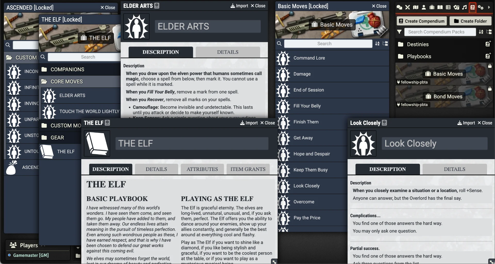

# Fellowship 2E Module (Unofficial)

    
     
     
    
    

     
     
     
    

   	

### An unofficial Fellowship 2E module for Foundry VTT using the PbtA System
Fellowship 2nd Edition is a tabletop role-playing game that emphasizes collaborative storytelling and world-building, inspired by epic journeys like The Lord of the Rings or Avatar: The Last Airbender. Players take on the roles of iconic heroes from distinct cultures, each wielding unique powers and abilities, as they band together to confront a shared adversary, known as the Overlord.

The ideas used in this module are from Fellowship 2E from [Liberi Gothica Games](https://liberigothica.itch.io/) Written by [Vel Mini](https://bsky.app/profile/velimini.bsky.social). You can get the Books at [itch.io](https://liberigothica.itch.io/fellowship-a-tabletop-adventure-game)

This module is for [Foundry VTT](https://foundryvtt.com/) and requires the [PbtA System](https://github.com/asacolips-projects/pbta) created by [asacolips](https://github.com/asacolips).

If you’ve enjoyed my work and find value in what I create, please consider supporting me with a small donation on [Ko-fi](https://ko-fi.com/G2G3I91JQ). I truly love what I do, and your support helps me dedicate time and resources to ongoing development. Every contribution, no matter the size, makes a difference and allows me to continue doing what I’m passionate about. Thank you for considering—it means the world to me.

## Screenshot

## Dependencies
The following Foundry VTT game system must be installed to use this module: [Powered by the Apocalypse](https://foundryvtt.com/packages/pbta).

## How to Install
You can install the latest released version of the module by using this manifest link in Foundry VTT. [Instructions](https://foundryvtt.com/article/tutorial/): [module.json](https://github.com/philote/fellowship-pbta/releases/latest/download/module.json)

## Features
- Character Sheet
    - PbtA Character Playbook support
    - Added Destiny support
    - Added Companion support
    - sheet designs
- NPC/Threat Sheet 
- Item Compendiums
    - Playbooks
    - Destinies
    - Playbook Companions
    - Gear
    - All of the Basic, Bond, Playbook Moves
    - All of the NPC/Threats

## TODO
- Overlord Sheet [In-progress]
- Overlord Moves

# License & Acknowledgements
## Fellowship 2nd Edition
[Fellowship 2nd Edition](https://liberigothica.itch.io/fellowship-a-tabletop-adventure-game) was created by [Vel Mini](@velimini.bsky.social) and is copyright (2015-2019) by Vel Mini and [Liberi Gothica Games](https://liberigothica.itch.io/). The content in the book Fellowship 2e book is under the Creative Commons CC-BY-SA License:
https://creativecommons.org/licenses/by-sa/4.0/

## Images from [Smithsonian Open Access](https://www.si.edu/openaccess)
This media is in the public domain (free of copyright restrictions). You can copy, modify, and distribute this work without contacting the Smithsonian. For more information, visit the Smithsonian's Terms of Use page at https://www.si.edu/Termsofuse

### NMNH-LEW87005c2_1pt25x_ppl
Used for background texture \
__Smithsonian Record ID:__ [edanmdm:nmnhmineralsciences_1037187](http://n2t.net/ark:/65665/35c1f77f0-7b52-49cf-b86c-84d9a1fe725d) \
__File Usage:__ CC0

### CHSDM-AE920E7F4CF92-000001
Used for background texture \
__Smithsonian Record ID:__ [edanmdm:chndm_1979-91-953](http://n2t.net/ark:/65665/kq4d02a3c84-a1ad-451b-963b-208517d7d8aa) \
__File Usage:__ CC0