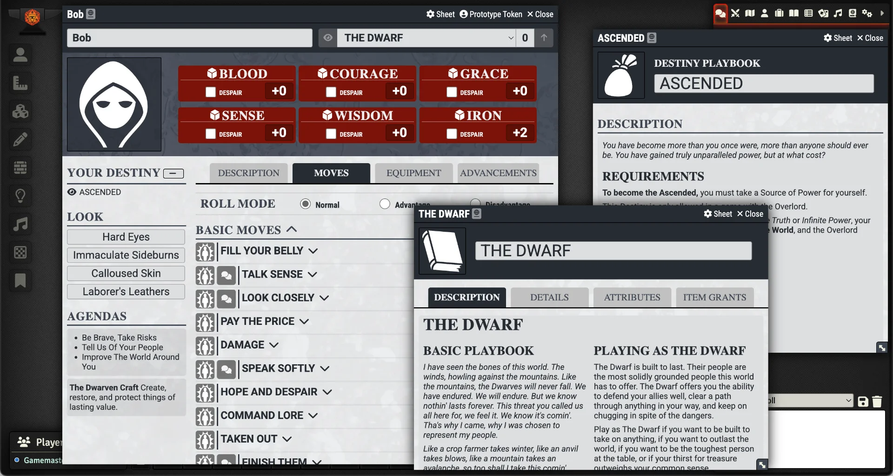

# Fellowship 2E Module (Unofficial)
> [!Warning]
> This module is in the early stages of development, use with caution.

     
     
     
    <!--  -->
     

     
     
     
     

### An unofficial Fellowship 2E module for Foundry VTT using the PbtA System
Fellowship 2nd Edition is a tabletop role-playing game that emphasizes collaborative storytelling and world-building, inspired by epic journeys like The Lord of the Rings or Avatar: The Last Airbender. Players take on the roles of iconic heroes from distinct cultures, each wielding unique powers and abilities, as they band together to confront a shared adversary, known as the Overlord.

The ideas used in this module are from Fellowship 2E from [Liberi Gothica Games](https://liberigothica.itch.io/). You can get the Books at: https://liberigothica.itch.io/fellowship-a-tabletop-adventure-game

This module is for [Foundry VTT](https://foundryvtt.com/) and requires the [PbtA System](https://github.com/asacolips-projects/pbta) created by [asacolips](https://github.com/asacolips).

## Screenshot

## Dependencies
The following Foundry VTT game system must be installed to use this module: [Powered by the Apocalypse](https://foundryvtt.com/packages/pbta).

## How to Install
You can install the latest released version of the module by using this manifest link in Foundry VTT. [Instructions](https://foundryvtt.com/article/tutorial/): https://github.com/philote/fellowship-pbta/releases/latest/download/system.json

## Features
- Character sheet
    - PbtA Playbook support

## TODO
- Overlord sheet
- NPC sheet
- Create support for companions
- Create support for Destiny Playbooks
- Styling

# License & Acknowledgements
[Fellowship 2nd Edition](https://liberigothica.itch.io/fellowship-a-tabletop-adventure-game) was created by [Vel Mini](@velimini.bsky.social) and is copyright (2015-2019) by Vel Mini and [Liberi Gothica Games](https://liberigothica.itch.io/).

Icons from game-icons.net are released under a Creative Commons Attribution 3.0 Unported license. https://creativecommons.org/licenses/by/3.0/
